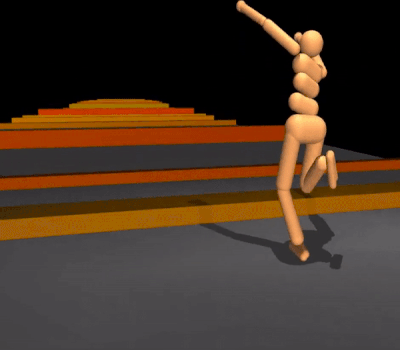

# RL Algorithms from Scratch

Implementations of core reinforcement learning algorithms written from scratch,
with the math worked out alongside the code. Built as a learning project while
working through Sutton & Barto and related material.



## What's inside

| Folder | Algorithms | Environment |
| --- | --- | --- |
| [`Dynamic programming methods/`](Dynamic%20programming%20methods/) | Policy evaluation, policy improvement, policy iteration, value iteration, Monte Carlo prediction, double Q-learning, ε-greedy bandits | FrozenLake, multi-armed bandit |
| [`mc_control/`](mc_control/) | On-policy first-visit Monte Carlo control (ε-greedy) | FrozenLake |
| [`DQN/`](DQN/) | Deep Q-Network with replay buffer + target network | CartPole-v1 |

The dynamic programming folder has its own [readme](Dynamic%20programming%20methods/readme.md)
with the derivations (Bellman equations, the policy improvement theorem, etc.).

## Setup

Requires Python 3.12+.

```bash
python -m venv .venv
source .venv/bin/activate        # Windows: .venv\Scripts\activate
pip install -r requirements.txt
```

## Running

Each folder is self-contained. Run a script from inside its folder so the local
imports resolve:

```bash
# Dynamic programming on FrozenLake (sweeps gamma, plots policy values)
cd "Dynamic programming methods" && python main.py

# Monte Carlo control on FrozenLake
cd mc_control && python mc_control.py

# Deep Q-Network on CartPole
cd DQN && python main.py
```

> Note: `Dynamic programming methods/exploitation_exploration.py` uses the legacy
> `gym` API; everything else uses `gymnasium`. Both are in `requirements.txt`.

## References

- Sutton & Barto, *Reinforcement Learning: An Introduction* (freely available from
  the authors at <http://incompleteideas.net/book/the-book.html>)
- Mnih et al., *Playing Atari with Deep Reinforcement Learning* — the DQN paper
  ([`DQN/1312.5602v1.pdf`](DQN/1312.5602v1.pdf))

See [`Resources/readme.md`](Resources/readme.md) for the current reading list.
